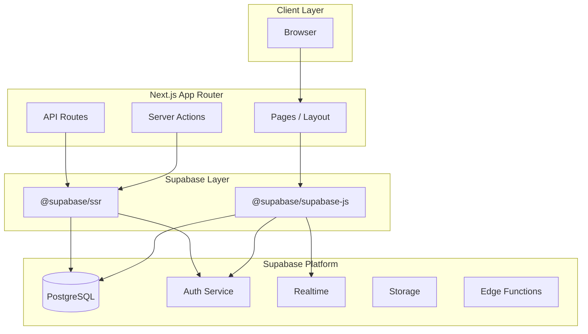

# Supabase Architecture Plan

## Overview
This document outlines the architecture for integrating Supabase as the backend database in this Next.js 14 monorepo.

---

## 1. System Architecture

### 1.1 High-Level Architecture



### 1.2 Data Flow Patterns

| Pattern | Use Case | Implementation |
|---------|----------|----------------|
| **Server Components** | Initial data fetching, static content | Direct Supabase client in Server Components |
| **Server Actions** | Form submissions, mutations | Next.js Server Actions with Supabase |
| **Client Components** | Real-time data, user interactions | React Query / SWR + Supabase Realtime |
| **Route Handlers** | External API integrations, webhooks | Next.js API Routes |

---

## 2. Database Schema Design

### 2.1 Core Tables

#### Users (Extended Profile)
```sql
-- Extends auth.users with additional profile data
create table public.profiles (
  id uuid references auth.users on delete cascade primary key,
  username text unique,
  full_name text,
  avatar_url text,
  created_at timestamptz default now(),
  updated_at timestamptz default now()
);
```

#### Example Application Tables
```sql
-- Posts/Content Table (example)
create table public.posts (
  id uuid default gen_random_uuid() primary key,
  user_id uuid references public.profiles(id) on delete cascade,
  title text not null,
  content text,
  status text default 'draft', -- draft, published, archived
  created_at timestamptz default now(),
  updated_at timestamptz default now()
);

-- Categories/Tags Table (example)
create table public.tags (
  id uuid default gen_random_uuid() primary key,
  name text not null unique,
  color text,
  created_at timestamptz default now()
);

-- Many-to-many relationship
create table public.post_tags (
  post_id uuid references public.posts(id) on delete cascade,
  tag_id uuid references public.tags(id) on delete cascade,
  primary key (post_id, tag_id)
);
```

### 2.2 Row Level Security (RLS) Policies

```sql
-- Profiles: Users can read all, update only own
alter table public.profiles enable row level security;

create policy "Public profiles are viewable by everyone"
  on public.profiles for select using (true);

create policy "Users can update own profile"
  on public.profiles for update using (auth.uid() = id);

-- Posts: Users can CRUD own posts
alter table public.posts enable row level security;

create policy "Published posts are viewable by everyone"
  on public.posts for select using (status = 'published');

create policy "Users can view own drafts"
  on public.posts for select using (auth.uid() = user_id);

create policy "Users can create posts"
  on public.posts for insert with check (auth.uid() = user_id);

create policy "Users can update own posts"
  on public.posts for update using (auth.uid() = user_id);

create policy "Users can delete own posts"
  on public.posts for delete using (auth.uid() = user_id);
```

### 2.3 Database Functions & Triggers

```sql
-- Auto-update updated_at timestamp
create or replace function public.handle_updated_at()
returns trigger as $$
begin
  new.updated_at = now();
  return new;
end;
$$ language plpgsql;

-- Apply to tables
create trigger posts_updated_at
  before update on public.posts
  for each row execute function public.handle_updated_at();

create trigger profiles_updated_at
  before update on public.profiles
  for each row execute function public.handle_updated_at();

-- Create profile on user signup
create or replace function public.handle_new_user()
returns trigger as $$
begin
  insert into public.profiles (id, username, full_name)
  values (new.id, new.raw_user_meta_data->>'username', new.raw_user_meta_data->>'full_name');
  return new;
end;
$$ language plpgsql security definer;

create trigger on_auth_user_created
  after insert on auth.users
  for each row execute function public.handle_new_user();
```

---

## 3. TypeScript Integration

### 3.1 Generated Types

Create a `database.types.ts` file via Supabase CLI:

```bash
supabase gen types typescript --project-id <project-ref> --schema public > apps/web/lib/database.types.ts
```

### 3.2 Typed Supabase Client

```typescript
// apps/web/lib/supabase/client.ts
import { createBrowserClient } from '@supabase/ssr'
import { Database } from './database.types'

export function createClient() {
  return createBrowserClient<Database>(
    process.env.NEXT_PUBLIC_SUPABASE_URL!,
    process.env.NEXT_PUBLIC_SUPABASE_ANON_KEY!
  )
}
```

```typescript
// apps/web/lib/supabase/server.ts
import { createServerClient, type CookieOptions } from '@supabase/ssr'
import { cookies } from 'next/headers'
import { Database } from './database.types'

export function createClient() {
  const cookieStore = cookies()
  
  return createServerClient<Database>(
    process.env.NEXT_PUBLIC_SUPABASE_URL!,
    process.env.NEXT_PUBLIC_SUPABASE_ANON_KEY!,
    {
      cookies: {
        get(name: string) {
          return cookieStore.get(name)?.value
        },
        set(name: string, value: string, options: CookieOptions) {
          cookieStore.set({ name, value, ...options })
        },
        remove(name: string, options: CookieOptions) {
          cookieStore.set({ name, value: '', ...options })
        },
      },
    }
  )
}
```

---

## 4. Authentication Strategy

### 4.1 Auth Flows

| Method | Use Case | Implementation |
|--------|----------|----------------|
| **Email/Password** | Traditional signup/login | Supabase Auth with email confirmation |
| **Magic Link** | Passwordless login | `supabase.auth.signInWithOtp()` |
| **OAuth** | Social login (Google, GitHub, etc.) | `supabase.auth.signInWithOAuth()` |
| **Anonymous** | Guest users | `supabase.auth.signInAnonymously()` |

### 4.2 Auth Middleware Pattern

```typescript
// middleware.ts (at root of apps/web)
import { createServerClient, type CookieOptions } from '@supabase/ssr'
import { NextResponse, type NextRequest } from 'next/server'

export async function middleware(request: NextRequest) {
  let response = NextResponse.next({
    request: {
      headers: request.headers,
    },
  })

  const supabase = createServerClient(
    process.env.NEXT_PUBLIC_SUPABASE_URL!,
    process.env.NEXT_PUBLIC_SUPABASE_ANON_KEY!,
    {
      cookies: {
        get(name: string) {
          return request.cookies.get(name)?.value
        },
        set(name: string, value: string, options: CookieOptions) {
          request.cookies.set({ name, value, ...options })
          response = NextResponse.next({
            request: { headers: request.headers },
          })
          response.cookies.set({ name, value, ...options })
        },
        remove(name: string, options: CookieOptions) {
          request.cookies.set({ name, value: '', ...options })
          response = NextResponse.next({
            request: { headers: request.headers },
          })
          response.cookies.set({ name, value: '', ...options })
        },
      },
    }
  )

  // Refresh session if expired
  await supabase.auth.getSession()

  return response
}

export const config = {
  matcher: [
    '/((?!_next/static|_next/image|favicon.ico|.*\\.(?:svg|png|jpg|jpeg|gif|webp)$).*)',
  ],
}
```

---

## 5. Data Fetching Patterns

### 5.1 Server Components

```typescript
// apps/web/app/page.tsx
import { createClient } from '@/lib/supabase/server'

export default async function HomePage() {
  const supabase = createClient()
  
  const { data: posts, error } = await supabase
    .from('posts')
    .select('*')
    .eq('status', 'published')
    .order('created_at', { ascending: false })
    .limit(10)

  if (error) {
    console.error('Error fetching posts:', error)
    return <div>Error loading posts</div>
  }

  return (
    <main>
      <h1>Latest Posts</h1>
      {posts?.map((post) => (
        <article key={post.id}>
          <h2>{post.title}</h2>
          <p>{post.content}</p>
        </article>
      ))}
    </main>
  )
}
```

### 5.2 Server Actions

```typescript
// apps/web/lib/actions/posts.ts
'use server'

import { createClient } from '@/lib/supabase/server'
import { revalidatePath } from 'next/cache'

export async function createPost(formData: FormData) {
  const supabase = createClient()
  
  const { data: { user } } = await supabase.auth.getUser()
  
  if (!user) {
    throw new Error('Unauthorized')
  }

  const title = formData.get('title') as string
  const content = formData.get('content') as string

  const { error } = await supabase
    .from('posts')
    .insert({
      user_id: user.id,
      title,
      content,
    })

  if (error) {
    throw new Error(error.message)
  }

  revalidatePath('/')
}
```

### 5.3 Client Components with Realtime

```typescript
// apps/web/components/RealtimePosts.tsx
'use client'

import { useEffect, useState } from 'react'
import { createClient } from '@/lib/supabase/client'

export function RealtimePosts() {
  const [posts, setPosts] = useState<any[]>([])
  const supabase = createClient()

  useEffect(() => {
    // Initial fetch
    const fetchPosts = async () => {
      const { data } = await supabase
        .from('posts')
        .select('*')
        .eq('status', 'published')
      
      if (data) setPosts(data)
    }
    fetchPosts()

    // Realtime subscription
    const channel = supabase
      .channel('posts_changes')
      .on(
        'postgres_changes',
        {
          event: '*',
          schema: 'public',
          table: 'posts',
          filter: 'status=eq.published',
        },
        (payload) => {
          console.log('Change received!', payload)
          // Update state based on change type
          if (payload.eventType === 'INSERT') {
            setPosts((prev) => [payload.new, ...prev])
          } else if (payload.eventType === 'DELETE') {
            setPosts((prev) => prev.filter((p) => p.id !== payload.old.id))
          } else if (payload.eventType === 'UPDATE') {
            setPosts((prev) =>
              prev.map((p) => (p.id === payload.new.id ? payload.new : p))
            )
          }
        }
      )
      .subscribe()

    return () => {
      supabase.removeChannel(channel)
    }
  }, [supabase])

  return (
    <div>
      {posts.map((post) => (
        <article key={post.id}>
          <h2>{post.title}</h2>
          <p>{post.content}</p>
        </article>
      ))}
    </div>
  )
}
```

---

## 6. Environment Configuration

### 6.1 Required Environment Variables

Create these files in `apps/web/`:

```bash
# .env.local (gitignored - for local development)
NEXT_PUBLIC_SUPABASE_URL=https://<project-ref>.supabase.co
NEXT_PUBLIC_SUPABASE_ANON_KEY=<anon-key>
SUPABASE_SERVICE_ROLE_KEY=<service-role-key> # Server-side only
```

```bash
# .env.example (committed to repo)
NEXT_PUBLIC_SUPABASE_URL=your_supabase_project_url
NEXT_PUBLIC_SUPABASE_ANON_KEY=your_supabase_anon_key
SUPABASE_SERVICE_ROLE_KEY=your_supabase_service_role_key
```

### 6.2 Environment Variable Validation

```typescript
// apps/web/lib/env.ts
import { z } from 'zod'

const envSchema = z.object({
  NEXT_PUBLIC_SUPABASE_URL: z.string().url(),
  NEXT_PUBLIC_SUPABASE_ANON_KEY: z.string().min(1),
  SUPABASE_SERVICE_ROLE_KEY: z.string().min(1).optional(),
})

export const env = envSchema.parse(process.env)
```

---

## 7. Package Dependencies

### 7.1 Required Packages

```json
// Add to apps/web/package.json
{
  "dependencies": {
    "@supabase/supabase-js": "^2.39.0",
    "@supabase/ssr": "^0.1.0"
  },
  "devDependencies": {
    "supabase": "^1.145.0"
  }
}
```

### 7.2 Optional Packages

| Package | Purpose |
|---------|---------|
| `@tanstack/react-query` | Server state management |
| `zod` | Schema validation |
| `zustand` | Client state management |

---

## 8. Project Structure

```
apps/web/
├── app/
│   ├── layout.tsx              # Root layout with providers
│   ├── page.tsx                # Home page
│   ├── auth/
│   │   ├── callback/           # OAuth callback handler
│   │   │   └── route.ts
│   │   ├── login/
│   │   │   └── page.tsx
│   │   └── signup/
│   │       └── page.tsx
│   └── api/
│       └── webhooks/           # Supabase webhooks
│           └── route.ts
├── components/
│   ├── auth/
│   │   ├── LoginForm.tsx
│   │   └── SignupForm.tsx
│   └── providers/
│       └── SupabaseProvider.tsx
├── lib/
│   ├── supabase/
│   │   ├── client.ts           # Browser client
│   │   ├── server.ts           # Server client
│   │   └── middleware.ts       # Middleware helper
│   ├── database.types.ts       # Generated types
│   └── actions/                # Server Actions
│       └── posts.ts
├── middleware.ts               # Next.js middleware
└── .env.local                  # Environment variables
```

---

## 9. Implementation Roadmap

### Phase 1: Foundation (Priority: High)
1. [ ] Install Supabase dependencies
2. [ ] Create environment variable templates
3. [ ] Set up typed Supabase clients (browser + server)
4. [ ] Create Next.js middleware for auth session refresh
5. [ ] Create SupabaseProvider React component

### Phase 2: Authentication (Priority: High)
1. [ ] Create auth pages (login, signup)
2. [ ] Implement OAuth providers (if needed)
3. [ ] Set up auth callbacks
4. [ ] Create protected route helpers

### Phase 3: Database Schema (Priority: High)
1. [ ] Create tables in Supabase dashboard
2. [ ] Set up RLS policies
3. [ ] Generate TypeScript types
4. [ ] Create database functions and triggers

### Phase 4: Data Layer (Priority: Medium)
1. [ ] Implement Server Actions for CRUD
2. [ ] Create reusable data fetching hooks
3. [ ] Set up real-time subscriptions
4. [ ] Add optimistic updates

### Phase 5: Advanced Features (Priority: Low)
1. [ ] Storage integration for file uploads
2. [ ] Edge Functions for custom logic
3. [ ] Webhook handlers
4. [ ] Analytics and monitoring

---

## 10. Security Considerations

1. **Never expose service role key on client** - Use RLS policies
2. **Enable RLS on all tables** - Default deny access
3. **Validate all inputs** - Use Zod schemas
4. **Use parameterized queries** - Supabase client does this automatically
5. **Implement rate limiting** - On Server Actions and API routes
6. **Audit authentication** - Log auth events
7. **Secure webhook endpoints** - Verify Supabase signatures

---

## 11. Migration Path

For existing projects migrating to Supabase:

1. **Export existing data** to CSV/JSON
2. **Create matching schema** in Supabase
3. **Import data** via Supabase dashboard or scripts
4. **Update application code** incrementally
5. **Run parallel systems** during transition
6. **Test thoroughly** before switching over
